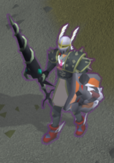
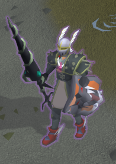

# Player Status Highlight

This plugin allows the player character to glow when under the effects of antipoison, antivenom, antifire, or super antifire potions. The colors, sizes, and fading effects for each status effect can be individually customized.

Do your antipoison/venom/fire timers get lost in the commotion of bossing? Wish you had an easy visual indicator for your immunity buffs? Do you keep forgetting to check the timer and ignore the sound effects and chat messages warning you that your immunity is running out? Or do you just want to look cool when all buffed up? This plugin will help with all of these issues.

| No immunity | Poison immunity | Venom immunity | Antifire | Super antifire |
|------|------|------|------|------|
|  |  |  |  |  |

Note that ALL highlight colors are customizable in the configuration.

## Configuration

For each type of immunity, the user may toggle whether the player is highlighted with that immunity and configure the color, thickness, and feather/fade effect of the highlight.

The configuration menu has a "Combinations" category for color choice combinations of antifire/superantifire and poison or venom immunity.

